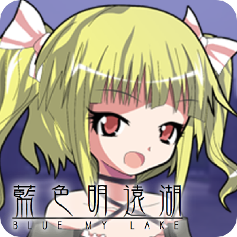

# Blue-Mingyuan-Lake

Blue Mingyuan Lake is a Campus Navigation RPG Mobile game dedicated to Sichuan University of China, featuring 2D depiction of Jiangan Campus, in-campus GPS positioning and fascinating storylines. See [Blue Mingyuan Lake—RPG Mobile Game](https://youtu.be/ax3AKhc8Y30) for a showcase video. 

The game tells of a story about the adventure of a freshman at her first year in Sichuan University. In the game, you have just arrived at Jiangan Campus and about to begin your university life. While you are excitedly exploring the campus, you find something magical about the lake located at the center of the campus. You later learned of its ancient name: Mingyuan. 

## Installation
Android installation package and Windows executables can be found [here](https://github.com/bluemylake/Blue-Mingyuan-Lake/releases). 

## Features
The game features a game map modelling the real Jiangan Campus in classic 2D RPG game settings, with 100 NPCs scattered around the campus, telling stories and anecdotes of Sichuan University.

The game also provides in-campus positioning function for new students. When you are lost in the campus, just turn on GPS on your mobile device and your location will be marked on the game map. 

While inheriting the classic elements of RPG turn-based combat system, this game implements an original set of rules that make the gameplay simpler but more captivating.

The plot of the game includes 2 storylines, 10 AVG scenes and 5 bosses to beat.

## How to Play

Move the character with direction buttons on the left of the screen. Start conversation with NPCs with the button on the right. Game menu is on the top right of the screen where you can enter map mode, save the game or quit. Swipe the screen to enter eagle-view mode. 
